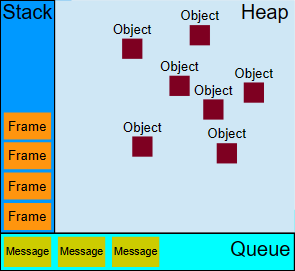

**注意: 该文章参考2023.07Mdn的文档,文中并没有提到宏任务的概念**
### Javascript执行上下文

- Javascript代码运行在执行上下文中
- 以下三种情况会创建一段新的上下文
  - Javascript之外的函数执行, 可以理解为初始化Javascript
  - 函数执行
  - 使用eval()函数
- 上下文可以让我们对一些全局或者局部函数有更好的管理
  
### Javascript 运行时
执行Javascript代码的时候,都维护了一组用于执行Javascript代码的**代理**,每一个代理可能包括: 
-  执行上下文合集
-  执行上下文栈
-  主线程
-  一组可能用于执行worker的额外线程集合
-  **一个任务队列**
-  **一个微任务队列**
#### 事件循环
- 每个**代理**都是由事件循环驱动的
- 循环的顺序: 任务队列中处于等待的任务 -> 微任务 ->渲染前准备工作 

#### 普通任务 vs 微任务
- 当执行来自任务队列中的任务时，在每一次新的事件循环开始迭代的时候运行时都会执行队列中的每个任务。在每次迭代开始之后加入到队列中的任务需要在下一次迭代开始之后才会被执行
- 每次当一个任务退出且执行上下文栈为空的时候，微任务队列中的每一个微任务会依次被执行。不同的是它会等到微任务队列为空才会停止执行——即使中途有微任务加入。换句话说，微任务可以添加新的微任务到队列中，这些新的微任务将在下一个任务开始运行之前，在当前事件循环迭代结束之前执行。
- 通俗的讲:  循环开始->普通任务 -> 微任务(可以添加新的微任务)-> 新的循环

#### 怎么触发微任务呢: 
- 调用 queueMicrotask() 方法。
- 执行 Promise 的 then()、catch() 或 finally() 方法。
- 执行 setTimeout()、setInterval() 或 requestAnimationFrame() 方法，但参数为 0。
- 执行 XMLHttpRequest 的 onload() 或 onerror() 事件处理程序。
- 执行 fetch() 方法，但参数为 null。