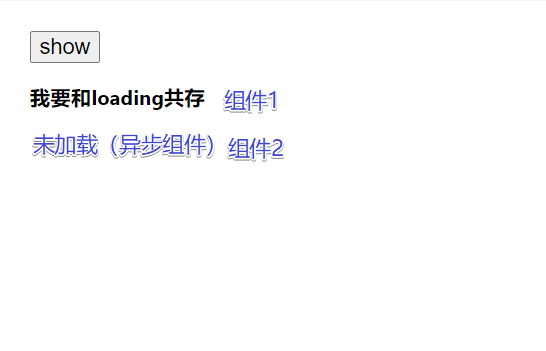
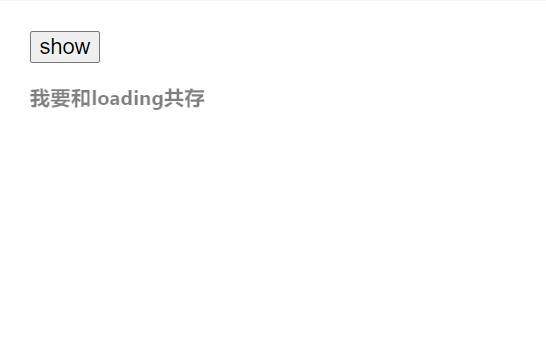

`useTransition` 是一个帮助你在**不阻塞** UI 的情况下更新状态的 React Hook

```jsx
const [isPending, startTransition] = useTransition();
```

#### 注意

- 传递给 startTransition 的函数必须是同步的
- 在 startTransition 中的**所有状态更新**会被标记上 transition,标记了 transition 之后 UI 不会被阻塞,例如**你点击了 A 路由,在跳转结束前你可以立即点击 B 路由,可以不等待 A 直接跳转到 B**

_还有很多用法,下面深入一下最复杂的一种_

#### 避免加载态覆盖已加载内容

先来看没加载时候的状态:

图中的组件一和组件二都包裹`Suspense`中,`Suspense`的`callback`插槽里面有一个加载态,下面是代码

```jsx
//按钮开启加载
const Son = lazy(() => delay(import("./son")));
//记录
function delay(promise) {
	return new Promise((resolve) => {
		setTimeout(() => {
			resolve();
		}, 1000);
	}).then(() => promise);
}
const Temp = ({ isPending }) => {
	return (
		<>
			<h3 style={{ opacity: isPending ? 0.5 : 1 }}>我要和loading共存</h3>
		</>
	);
};
//记录
const Test = () => {
	const [isPending, startTransition] = useTransition();
	const [isShow, setisShow] = useState(false);
	const clickCb = () => {
		console.log("状态改变");
		startTransition(() => {
			setisShow(!isShow);
		});
	};
	return (
		<>
			{false && <h1>this is 学习页面</h1>}
			{/* 记录 */}
			<button onClick={() => clickCb()}>show</button>

			<Suspense fallback={<div>loading...</div>}>
				<Temp isPending={isPending} />
				{isShow && <Son />}
			</Suspense>
		</>
	);
};
```

点击按钮,异步组件开始加载,整个 Suspense 中的默认显示全都被替换成了**Loading...**,
但是组件 1 不是异步的,我们并不希望将组件 1 也替换掉,于是我们给按钮触发的加载上加上 startTransition,打上`transition`标签后,组件 1 不会消失了
然后将 isPending 传递到组件 1 中,组件 1 自行处理 Pending 状态下的样式,最终效果(添加透明度):


下面是代码:

```jsx
const clickCb = () => {
	console.log("状态改变");
	startTransition(() => {
		setisShow(!isShow);
	});
};
```

#### 深入 transition

startTransition 的非阻塞更新的背后原理是使用一个虚拟 dom 计算出要更新的内容，然后将更新放到下一次渲染

```jsx title="注意startTransition影响范围"
const clickCb = () => {
	console.log("状态改变");
	startTransition(() => {
		setisShow(!isShow);
	});
};
return (
	<button onClick={()=>clickCb()}>show</button>
    <Suspense fallback={<div>loading...</div>}>
        <Temp isPending={isPending}/>
        {isShow && <Son />}
    </Suspense>
);
```

虽然isShow只对Son组件有影响,但是Suspense自动的检测里面有没有transition标记的组件,在这里fallback不会在**Son挂起的时候立即执行**,自然其他没有被挂起的组件不会被fallback覆盖

#### 使用startTransition vs 不使用
这里有一个图可以更直观的说明:

**不使用的情况**:
第一次渲染

| 计算 | 渲染 |
|---|---|
| `Temp` 组件被挂起 | `fallback` 元素 |
| `Son` 组件被挂起 | `fallback` 元素 |

第二次渲染

| 计算 | 渲染 |
|---|---|
| `Temp` 组件被挂起 | `fallback` 元素 |
| `Son` 组件被挂起 | `fallback` 元素 |

**使用的情况**:
第一次渲染

| 计算 | 渲染 |
|---|---|
| `Temp` 组件被挂起 | `Temp` 组件 |
| `Son` 组件未被挂起 | `Son` 组件 |

第二次渲染

| 计算 | 渲染 |
|---|---|
| `Temp` 组件被挂起 | `fallback` 元素 |
| `Son` 组件未被挂起 | `Son` 组件 |


